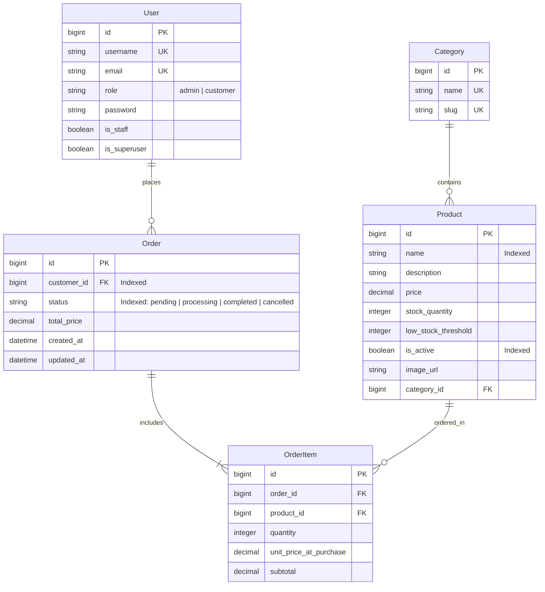

# PROJECT CONTEXT — Project Technodha (Inventory & Order Management System)

This document provides a comprehensive technical overview, architecture specification, security policies, data model reference, and operational guide for **Project Technodha**.

---

## 1. Executive Summary & Core Requirements

**Project Technodha** is a production-grade, full-stack Inventory, Order Processing, and Customer Storefront application.

### Key Capabilities
- **Storefront & Product Catalogue**: Interactive catalogue with real-time search, category filter pills, sorting (`price`, `-price`, `name`, `-created_at`), Quick View modal, INR (`₹`) formatting, and live stock badges (*In Stock*, *Low Stock*, *Out of Stock*).
- **Atomic Concurrency & Stock Locks**: Order placement uses `transaction.atomic()` and `select_for_update()` on `Product` rows sorted by Primary Key to eliminate deadlocks and prevent race conditions/overselling under high load.
- **Server-Side Price Integrity**: All line item subtotals and order total prices are computed server-side from database product prices. Client-supplied totals are rejected/ignored.
- **Order Lifecycle & State Guards**: State machine transition validation (`pending` → `processing` → `completed`). Invalid transitions (e.g. `completed` → `pending`) are strictly blocked with `400 Bad Request`.
- **Atomic Restocking on Cancellation**: Cancelling a pending/processing order automatically restocks item quantities inside an atomic database block.
- **Global Error Format**: Centralized DRF exception handler (`config.exceptions.custom_exception_handler`) delivering uniform `{ "error": "...", "detail": ..., "status_code": ... }` responses.
- **Health Check Probe**: Live endpoint `/api/health/` returning DB status (`{"status": "healthy", "database": "connected"}`).
- **Security & Rate Throttling**: CORS origin whitelist (`http://localhost:3000`, `http://localhost:5173`) and `ScopedRateThrottle` (`10/minute`) on sensitive auth endpoints.

---

## 2. Technical Stack

| Layer | Component | Technologies / Libraries |
| :--- | :--- | :--- |
| **Backend** | Framework & Runtime | Python 3.14, Django 5.x, Django REST Framework (DRF) |
| | Authentication | `djangorestframework-simplejwt`, SimpleJWT Blacklist |
| | Database | PostgreSQL 15+ (`technodha_db` on port `5432`) |
| | Image Storage | Cloudinary Python SDK (signed server-side uploads) |
| | Documentation & Testing | `drf-spectacular` (OpenAPI/Swagger), `pytest` & `pytest-django` |
| **Frontend** | Framework & Build Tool | React 18, Vite 8, React Router v6 |
| | UI Components & Styling | TailwindCSS v4, Shadcn UI (`base-ui`), `lucide-react` icons |
| | Data Fetching & Caching | `@tanstack/react-query` v5, `axios` (with auth interceptors) |

---

## 3. System Architecture & Directory Layout

```
Project_Technodha/
├── backend/
│   ├── config/
│   │   ├── settings.py           # Core Django settings, load_dotenv, CORS, Throttling
│   │   ├── urls.py               # Root API routing (/api/auth/, /api/products/, /api/orders/, /api/health/)
│   │   ├── exceptions.py         # Global custom DRF exception handler
│   │   └── pagination.py         # StandardResultsSetPagination (LimitOffset + page fallback)
│   └── apps/
│       ├── authentication/       # User model, Register, CustomTokenObtainPair, ScopedRateThrottle
│       ├── products/             # Category, Product models (indexed), CRUD, Cloudinary service
│       └── orders/               # Order, OrderItem models (indexed), OrderService transaction logic
├── frontend/
│   └── src/
│       ├── api/client.js         # Axios instance, Bearer auth interceptor & refresh handling
│       ├── context/              # AuthContext (user, tokens), CartContext (shopping cart)
│       ├── user/                 # User domain (Home, Catalogue, ProductDetail, CartPage, OrderHistory)
│       └── admin/                # Admin domain (AdminPanel, ProductManagement, CategoryManagement, ManageOrders)
├── .env                          # Local environment variables
├── .env.example                  # Sanitized environment template for deployments
├── docker-compose.yml            # Docker orchestration configuration
└── README.md                     # Quickstart documentation
```

---

## 4. Data Models & Database Schema



---

## 5. Security & Authorization Matrix

| Endpoint | Method | Rate Limit | Allowed Roles | Description / Security Policy |
| :--- | :--- | :--- | :--- | :--- |
| `/api/v1/health/` | GET | None | Public | Health probe returning DB connection status |
| `/api/v1/auth/register/` | POST | 10/min | Public | Creates `customer` user (`role` escalation blocked) |
| `/api/v1/auth/login/` | POST | 10/min | Public | Returns access + refresh JWTs, username, email & role |
| `/api/v1/auth/refresh/` | POST | 100/day | Public | Rotates access token given valid refresh token |
| `/api/v1/products/` | GET | 200/day | Public | Filterable via `search`, `category__slug`, `ordering`, `is_active` |
| `/api/v1/products/` | POST/PUT/DELETE | 2000/day | Admin | Full CRUD (DELETE executes soft-delete `is_active=False`) |
| `/api/v1/products/{id}/stock/` | POST | 2000/day | Admin | Direct stock quantity update |
| `/api/v1/products/upload-image/` | POST | 2000/day | Admin | Multipart signed image upload to Cloudinary (max 1MB) |
| `/api/v1/orders/` | GET | 2000/day | Authenticated | Customer sees own orders; Admin sees all orders |
| `/api/v1/orders/` | POST | 2000/day | Customer/Admin | Creates order within `transaction.atomic()` block |
| `/api/v1/orders/{id}/cancel/` | POST | 2000/day | Customer/Admin | Customer cancels `pending`; Admin cancels non-completed |
| `/api/v1/orders/{id}/status/` | PATCH | 2000/day | Admin | Enforces lifecycle: `pending` → `processing` → `completed` |
| `/api/v1/orders/dashboard/` | GET | 2000/day | Authenticated | Role-specific dashboard analytics |

---

## 6. Pagination System

API uses `StandardResultsSetPagination` (`config/pagination.py`):
- **Pagination Strategy**: `LimitOffsetPagination`
- **Default Limit**: `10`
- **Max Limit**: `100`
- **Parameters**: `?limit=<n>&offset=<n>` (e.g. `?limit=10&offset=20`).
- **Page Fallback**: Supports `?page=<n>` by computing `offset = (page - 1) * limit`.

---

## 7. Global Uniform Error Response Format

All API errors return a standard JSON structure:
```json
{
  "error": "ValidationError",
  "detail": {
    "items": ["Each item must specify valid product_id and positive integer quantity."]
  },
  "status_code": 400
}
```

---

## 8. Development & Operational Commands

### Backend Commands
```bash
cd backend
# Run server on port 8000
./venv/bin/python manage.py runserver 0.0.0.0:8000

# Apply migrations
./venv/bin/python manage.py migrate

# Seed database (40 products, 5 categories, 25 orders)
./venv/bin/python seed_data.py

# Run Pytest unit tests (26 passing tests)
./venv/bin/pytest
```

### Frontend Commands
```bash
cd frontend
# Run development server
npm run dev

# Verify production build
npm run build
```

---

## 9. Verified Health Status

- **Database**: Local PostgreSQL (`technodha_db`) on `localhost:5432`.
- **Health Check Probe**: `/api/health/` returning `{"status": "healthy", "database": "connected"}`.
- **Backend Test Suite**: 26/26 Pytest tests passing.
- **Frontend Production Build**: Vite build succeeds cleanly with zero errors.
