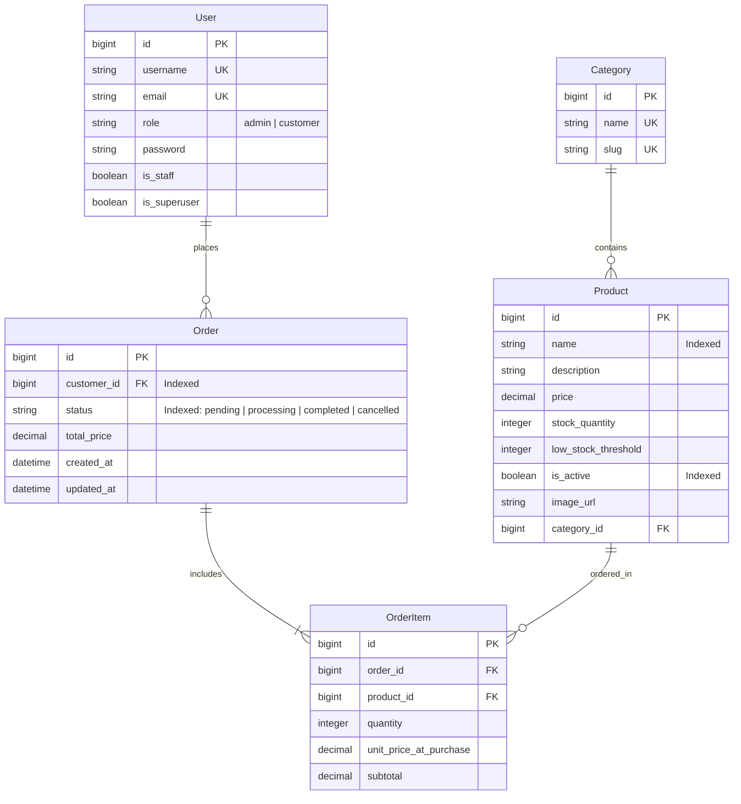

# PROJECT CONTEXT — Project Technodha (Inventory & Order Management System)

This document provides a comprehensive technical overview, architecture specification, security policies, data model reference, and operational guide for **Project Technodha**.

---

## 1. Executive Summary & Core Requirements

**Project Technodha** is a production-grade, full-stack Inventory, Order Processing, and Customer Storefront application.

### Key Capabilities
- **Storefront & Product Catalogue**: Interactive catalogue with real-time search, category filter pills, sorting (`price`, `-price`, `name`, `-created_at`), Quick View modal, INR (`₹`) formatting, and live stock badges (*In Stock*, *Low Stock*, *Out of Stock*).
- **Atomic Concurrency & Stock Locks**: Order placement uses `transaction.atomic()` and `select_for_update()` on `Product` rows sorted by Primary Key to eliminate deadlocks and prevent race conditions/overselling under high load.
- **Server-Side Price Integrity**: All line item subtotals and order total prices are computed server-side from database product prices. Client-supplied totals are rejected/ignored.
- **Order Lifecycle & State Guards**: State machine transition validation (`pending` → `processing` → `completed`). Invalid transitions (e.g. `completed` → `pending`) are strictly blocked with `400 Bad Request`.
- **Atomic Restocking on Cancellation**: Cancelling a pending/processing order automatically restocks item quantities inside an atomic database block.
- **Global Error Format**: Centralized DRF exception handler (`config.exceptions.custom_exception_handler`) delivering uniform `{ "error": "...", "detail": ..., "status_code": ... }` responses.
- **Health Check Probe**: Live endpoint `/api/health/` returning DB status (`{"status": "healthy", "database": "connected"}`).
- **Security & Rate Throttling**: CORS origin whitelist (`https://techstore.pritesh.site`, `https://api.techstore.pritesh.site`, `http://localhost:5173`) and `ScopedRateThrottle` (`10/minute`) on sensitive auth endpoints.
- **Cookie Token Storage**: JWT access (30-min expiry) and refresh tokens (10-day expiry) stored securely in client-side cookies (`SameSite=Lax`).
- **Dual Domain Reverse Proxy**: Dedicated Nginx server blocks for `techstore.pritesh.site` (Frontend React SPA) and `api.techstore.pritesh.site` (Backend Django REST API).
- **Automated CI/CD VPS Deployment**: GitHub Actions pipeline (`.github/workflows/ci.yml`) running backend Pytest, frontend Vitest, Vite production build, and automated SSH deployment over `appleboy/ssh-action`.

---

## 2. Technical Stack

| Layer | Component | Technologies / Libraries |
| :--- | :--- | :--- |
| **Backend** | Framework & Runtime | Python 3.14, Django 5.x, Django REST Framework (DRF) |
| | Authentication | `djangorestframework-simplejwt` (30m access, 10d refresh), SimpleJWT Blacklist |
| | Database | PostgreSQL 15+ (`technodha_db`) |
| | Image Storage | Cloudinary Python SDK (signed server-side uploads) |
| | Documentation & Testing | `drf-spectacular` (OpenAPI/Swagger), `pytest` & `pytest-django` |
| **Frontend** | Framework & Build Tool | React 18, Vite 8, React Router v6 |
| | UI Components & Styling | TailwindCSS v4, Shadcn UI (`base-ui`), `lucide-react` icons |
| | State & Token Management | `@tanstack/react-query` v5, Cookie-based token storage (`src/utils/cookies.js`), AuthContext |
| | Automated Testing | Vitest, React Testing Library |
| **DevOps & Infra** | Containerization | Docker, Docker Compose |
| | Reverse Proxy & SSL | Nginx, Let's Encrypt (Certbot SAN SSL) |
| | CI/CD | GitHub Actions, SSH deployment via `appleboy/ssh-action` |

---

## 3. System Architecture & Directory Layout

```
Project_Technodha/
├── .github/
│   └── workflows/
│       └── ci.yml                # CI/CD pipeline: Pytest, Vitest, Vite build, SSH VPS deployment
├── backend/
│   ├── config/
│   │   ├── settings.py           # Django settings, SimpleJWT (30m/10d), CORS, Throttling
│   │   ├── urls.py               # Root API routing (/api/auth/, /api/products/, /api/orders/, /api/health/)
│   │   ├── exceptions.py         # Global custom DRF exception handler
│   │   └── pagination.py         # StandardResultsSetPagination (LimitOffset + page fallback)
│   └── apps/
│       ├── authentication/       # User model, Register, CustomTokenObtainPair, ScopedRateThrottle
│       ├── products/             # Category, Product models (indexed), CRUD, Cloudinary service
│       └── orders/               # Order, OrderItem models (indexed), OrderService transaction logic
├── frontend/
│   ├── nginx.conf                # Dual-domain Nginx config (techstore.pritesh.site & api.techstore.pritesh.site)
│   └── src/
│       ├── api/client.js         # Axios instance with cookie Bearer auth & refresh interceptor
│       ├── utils/cookies.js      # Cookie helper module (setCookie, getCookie, removeCookie)
│       ├── context/              # AuthContext (cookie tokens, user state), CartContext
│       ├── user/                 # User domain (Home, Catalogue, ProductDetail, CartPage, OrderHistory, Login)
│       └── admin/                # Admin domain (AdminPanel, ProductManagement, CategoryManagement, ManageOrders)
├── scripts/
│   └── init-ssl.sh               # Let's Encrypt SAN SSL certificate bootstrapper
├── .env                          # Local environment variables
├── .env.example                  # Sanitized environment template for deployments
├── docker-compose.yml            # Docker orchestration configuration
├── AGENTS.md                     # Workspace & coding guidelines
└── README.md                     # Quickstart documentation
```

---

## 4. Data Models & Database Schema



---

## 5. Security & Authorization Matrix

| Endpoint | Method | Rate Limit | Allowed Roles | Description / Security Policy |
| :--- | :--- | :--- | :--- | :--- |
| `/api/v1/health/` | GET | None | Public | Health probe returning DB connection status |
| `/api/v1/auth/register/` | POST | 10/min | Public | Creates `customer` user (`role` escalation blocked) |
| `/api/v1/auth/login/` | POST | 10/min | Public | Returns access (30m) + refresh (10d) JWTs, username, email & role |
| `/api/v1/auth/refresh/` | POST | 100/day | Public | Rotates access token given valid refresh token |
| `/api/v1/products/` | GET | 200/day | Public | Filterable via `search`, `category__slug`, `ordering`, `is_active` |
| `/api/v1/products/` | POST/PUT/DELETE | 2000/day | Admin | Full CRUD (DELETE executes soft-delete `is_active=False`) |
| `/api/v1/products/{id}/stock/` | POST | 2000/day | Admin | Direct stock quantity update |
| `/api/v1/products/upload-image/` | POST | 2000/day | Admin | Multipart signed image upload to Cloudinary (max 1MB) |
| `/api/v1/orders/` | GET | 2000/day | Authenticated | Customer sees own orders; Admin sees all orders |
| `/api/v1/orders/` | POST | 2000/day | Customer/Admin | Creates order within `transaction.atomic()` block |
| `/api/v1/orders/{id}/cancel/` | POST | 2000/day | Customer/Admin | Customer cancels `pending`; Admin cancels non-completed |
| `/api/v1/orders/{id}/status/` | PATCH | 2000/day | Admin | Enforces lifecycle: `pending` → `processing` → `completed` |
| `/api/v1/orders/dashboard/` | GET | 2000/day | Authenticated | Role-specific dashboard analytics |

---

## 6. Token & Cookie Management

- **Access Token Expiry**: 30 Minutes (`timedelta(minutes=30)`)
- **Refresh Token Expiry**: 10 Days (`timedelta(days=10)`)
- **Cookie Attributes**: `SameSite=Lax`, `path=/`
- **Login Flow Redirects**:
  - Customer login redirects directly to Home page (`/`).
  - Admin login redirects to Admin Operations Panel (`/admin`).
  - Authenticated users navigating to `/login` are automatically redirected to `/`.

---

## 7. Global Uniform Error Response Format

All API errors return a standard JSON structure:
```json
{
  "error": "ValidationError",
  "detail": {
    "items": ["Each item must specify valid product_id and positive integer quantity."]
  },
  "status_code": 400
}
```

---

## 8. Development & Operational Commands

### Backend Commands
```bash
cd backend
# Run server on port 8000
./venv/bin/python manage.py runserver 0.0.0.0:8000

# Apply migrations
./venv/bin/python manage.py migrate

# Seed database (40 products, 5 categories, 25 orders)
./venv/bin/python seed_data.py

# Run Pytest unit tests (26 passing tests)
./venv/bin/pytest
```

### Frontend Commands
```bash
cd frontend
# Run development server
npm run dev

# Run Vitest unit test suite
npx vitest run

# Verify production build
npm run build
```

### Production Docker & SSL Commands
```bash
# Bootstrap dual domain SSL (techstore.pritesh.site & api.techstore.pritesh.site)
./scripts/init-ssl.sh

# Run containers with Docker Compose
docker compose up -d --build
```

---

## 9. Verified Health Status

- **Database**: PostgreSQL (`technodha_db`) with atomic concurrency locks.
- **Health Check Probe**: `/api/health/` returning `{"status": "healthy", "database": "connected"}`.
- **Backend Test Suite**: 26/26 Pytest tests passing cleanly.
- **Frontend Test Suite**: Vitest suite passing cleanly (`1 passed`).
- **Frontend Production Build**: Vite build succeeds cleanly with zero errors.
- **CI/CD Pipeline**: GitHub Actions automated build, test & VPS SSH deployment.
