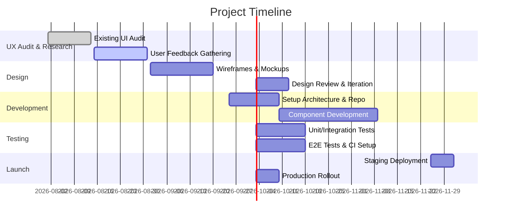

# UX Audit & Recommendations  
- **Usability:** Evaluate navigation clarity and content organization. Use consistent layout, clear labels, and user-friendly error messages. Ensure forms and workflows are simple and intuitive. Prioritize critical paths (e.g. signup, checkout).  
- **Accessibility (WCAG 2.1 AA):** Verify keyboard navigation, focus indicators, alt text on images, and ARIA labels. Ensure all UI controls have programmatic names/roles/states. Check color contrast ratios (min. 3:1 for UI components) and resizable text. Remove hard-coded text in images and supply text alternatives. Test with tools (WAVE, Axe) and address all WCAG 2.1 AA criteria.  
- **Responsiveness & Internationalization:** Design mobile-first with flexible grids and breakpoints. Use relative units (%, em) and CSS media queries. For i18n, externalize all strings and UI text (no hard-coded images/text). Support right-to-left (RTL) languages by using Unicode/HTML dir attributes and mirrored layouts. Allow dynamic UI adjustments for text length changes. Localize dates, times, and currency via libraries (Intl, moment.js locale). Avoid culturally-specific icons or colors.  
- **Performance:** Audit asset load times, bundle size, and network requests. Employ lazy-loading for images/code, use efficient data formats (WebP, compressed JSON) and caching (service workers, HTTP cache). Run Lighthouse audits to measure Core Web Vitals (LCP, FID, CLS). Optimize critical rendering path (minimize render-blocking CSS/JS). Prioritize above-the-fold content and defer off-screen images.  
- **Prioritized Recommendations:** Address critical WCAG failures first (e.g. missing alt text, contrast issues). Fix any broken navigation or form validation. Make UI fluid on small screens. Bundle-split code and minify assets for performance. Plan i18n strategy early to avoid rework. Use analytics/user testing to validate usability fixes.

# UI Improvements & Interaction Patterns  
Visual consistency is key: adopt a unified design language (colors, typography, spacing). For example, use a **clear typographic scale**, ample whitespace, and intuitive iconography. Ensure interactive elements (buttons, links) have affordances (hover/focus states, enlarged hit areas) and follow established patterns (e.g. hamburger menu on mobile, card layouts for data).  
 *Figure: Improved dashboard mockup showing clear charts, legends, and grouped controls (icons/labels). Consistent styling and information hierarchy enhance scan-ability.*  In a high-fidelity UI, present data in concise visual components (charts, tables) with tooltips and affordances. Use visual feedback (loading spinners, disabled states) on user actions. Where applicable, display **progress indicators** for long tasks. Incorporate skeleton loaders for perceived performance. Consider dark mode and high-contrast modes for accessibility. Always test color usage with contrast tools to meet WCAG (e.g. use user-friendly color palettes).  
 *Figure: Example analytics dashboard (placeholder) demonstrating a clear header, filters, and responsive layout.*  Emulate known patterns (e.g. profile dropdown in top-right, fixed navbar) to leverage user familiarity. Include interactive demo states (hoverable menus, expandable sections). Use **ARIA roles** on custom widgets. For international audiences, ensure fonts support all scripts and avoid images that embed text. Provide locale-switcher in a prominent place.

# Component Library Design (Props, State, TS Interfaces)  
Design a **reusable component library** with atomic components (Buttons, Inputs, Cards) and composite views. Define each component with clear **props interfaces** in TypeScript. For example:  
```ts
interface ButtonProps {
  label: string;
  onClick: () => void;
  disabled?: boolean;
}
```
Always type `props` explicitly to catch errors early. Use React’s `FC<>` or `PropsWithChildren` as needed. Document complex props with JSDoc for clarity. Adopt strict typing (“start strict, loosen as needed”) and use union types for mutually exclusive props. Keep props flat and minimal to avoid deeply nested shapes. Manage internal state with hooks (e.g. `useState`, `useReducer`) and lift state up or use context for shared data (e.g. ThemeContext). For larger apps, treat Redux Toolkit slices (see below) as sources of truth; props should primarily handle display and callbacks.

# Scalable Folder Structure (React+TypeScript+Vite)  
Use feature-based organization with one folder per component (and subfolder for nested components). For example:  
```
src/
├─ components/
│  ├─ Button/
│  │   ├ button.tsx
│  │   ├ button.test.tsx
│  │   ├ button.module.css
│  │   └ index.ts     // exports Button
│  ├─ Header/ … 
│  └─ Dashboard/
│      ├─ Dashboard.tsx
│      ├─ Dashboard.css
│      ├─ Dashboard.test.tsx
│      ├─ types.ts   // TS interfaces
│      └─ index.ts
├─ hooks/            // reusable custom hooks
├─ context/          // React Context providers
├─ utils/            // helper functions, constants
├─ api/              // RTK Query API slices or services
├─ assets/           // images, fonts, icons
├─ styles/           // global styles and tokens
└─ App.tsx           // app entry
```  
This aligns with best practices: each component lives in its own directory with accompanying tests and styles. Components and related files (hooks, types, stories) co-locate to ease navigation. Use `index.ts` “barrel” files to export public APIs, hiding implementation details. Avoid overly deep nesting (max ~2 levels) to maintain simplicity. Group reusable UI elements under `components/` and separate feature hooks (`hooks/`), contexts (`context/`), and utils (`utils/`) at the same src level. For absolute imports, configure `tsconfig.json` or Vite aliases (e.g. `@/components`) to simplify paths.  

| Folder Structure Pattern      | Pros                                | Cons                             |
| ----------------------------- | ----------------------------------- | -------------------------------- |
| **Feature folders (above)**   | Encapsulates each component. Tests/styles co-located. Easy to scale horizontally. | Many folders/files may seem verbose. Barrel files can complicate tree-shaking. |
| **By type (flat)**            | Flat `components/`, `hooks/`, etc improves separation of concerns. | Can scatter related files; harder to see which tests belong to which component. |
| **Monorepo style (yarn/npm workspaces)** | Good for multi-package projects (e.g. shared lib, config). | Adds complexity; not needed for single-app. |

# Sample Code & Implementation Guidelines  
- **Components & Routing:** Use React Router (for Vite) or Next.js pages for routing. Example with React Router v6:
  ```tsx
  import { BrowserRouter as Router, Routes, Route } from 'react-router-dom';
  <Router>
    <Routes>
      <Route path="/" element={<HomePage />} />
      <Route path="/dashboard" element={<DashboardPage />} />
    </Routes>
  </Router>
  ```
- **Redux Toolkit:** Set up slices under `store/`. Example:
  ```ts
  // store/counterSlice.ts
  import { createSlice, PayloadAction } from '@reduxjs/toolkit';
  interface CounterState { value: number }
  const slice = createSlice({
    name: 'counter',
    initialState: { value: 0 } as CounterState,
    reducers: {
      increment: state => { state.value += 1 },
      setValue: (state, action: PayloadAction<number>) => { state.value = action.payload }
    }
  });
  export const { increment, setValue } = slice.actions;
  export default slice.reducer;
  ```
- **RTK Query (or React Query):** If using Redux, create an *api slice* with `createApi` for server data. Otherwise use TanStack React Query hooks:
  ```ts
  // Example RTK Query slice
  const api = createApi({
    reducerPath: 'api',
    baseQuery: fetchBaseQuery({ baseUrl: '/api' }),
    endpoints: builder => ({
      getUsers: builder.query<User[], void>({ query: () => 'users' }),
    }),
  });
  export const { useGetUsersQuery } = api;
  ```
- **Styling:** Choose one approach:
  - *Tailwind CSS:* Highly productive utility classes (rapid prototyping, theming via config). Requires purge of unused classes.  
  - *CSS Modules:* Scoped `.module.css` files with familiar syntax (no runtime overhead). Need TypeScript support (declaration files or `css-loader` types).  
  - *styled-components:* Colocated CSS-in-JS with component logic (dynamic styling, theming). Has runtime style injection (manage via SSR/SSG) and a slight bundle overhead.  
  Include autoprefixer/PostCSS. For example, a Button with CSS Module:
  ```css
  /* Button.module.css */
  .btn { background: #0077cc; color: white; padding: 8px 16px; }
  .btnPrimary { border-radius: 4px; }
  ```
  ```tsx
  import styles from './Button.module.css';
  <button className={`${styles.btn} ${styles.btnPrimary}`}>Click</button>
  ```
- **TypeScript Config & Lint:** Use strict TS settings (`strict: true`). Add ESLint with `eslint-plugin-react` and `@typescript-eslint`. Prettier for formatting. Configure `eslintrc` to enforce rules (e.g. no `any`, consistent imports). Use lint-staged/Husky to auto-run lint and tests on commit.
- **Testing:**  
  - *Unit/Integration (Jest + React Testing Library):* Follow official guidelines: “write tests that resemble user usage”. For each component, test rendering and user interactions (fireEvent, screen queries). Include snapshots if needed for static parts. Mock only external services.  
  - *End-to-End (Playwright):* Write high-level tests for critical flows (login, checkout). Use Playwright’s recommended structure. Integrate with CI (e.g. GitHub Actions) per official docs. Example GH Action: install deps, run `npx playwright install` and `npx playwright test`. Configure Playwright `workers: 1` in CI for stability, or shard tests across multiple jobs for speed.
  
# Continuous Integration & DevOps  
- **CI Pipeline:** Use GitHub Actions/GitLab CI/CircleCI templates. Key steps: install Node, `npm ci`, run linters/tests (Jest/RTL), build, then run E2E (Playwright). For example, GitHub Actions:
  ```yaml
  name: CI
  on: [push, pull_request]
  jobs:
    build-and-test:
      runs-on: ubuntu-latest
      steps:
        - uses: actions/checkout@v5
        - uses: actions/setup-node@v6; with: node-version: 'lts/*'
        - run: npm ci
        - run: npm run lint && npm test
        - run: npx playwright install --with-deps
        - run: npx playwright test
  ```
  After CI, automatically generate coverage reports. Deploy (on `main`) to staging or production (via Vercel/Netlify/Heroku).  
- **CD:** Use deployment previews for PRs. Automate releases via Git tags. Perform smoke tests on the deployment.  
- **Quality Gates:** Fail CI if ESLint errors or tests fail. Enforce >90% coverage. Use a tool like SonarQube or CodeQL for code scanning if needed.  

# Performance & Accessibility Testing  
- **Lighthouse Audits:** Run Chrome Lighthouse in CI (via `lighthouse-ci`) to ensure performance and accessibility scores meet targets. Audit largest contentful paint, time-to-interactive, etc.  
- **Accessibility Testing:** Incorporate Axe or Pa11y in CI to catch issues. Include WCAG checks in test suites (e.g. `jest-axe`).  
- **Load Testing:** If needed, use WebPageTest or k6 for performance under load. Optimize images (responsive sizes) and enable caching/CDN.  

# Migration Plan & Rollout Checklist  
1. **Preparation:** Freeze UI/UX requirements. Backup current codebase. Verify all existing features work end-to-end.  
2. **Staging Migration:** Deploy improved UI on a staging environment. Migrate data as needed. QA testers run through test plans.  
3. **Gradual Rollout:** Use feature flags or branch by abstraction to switch to new UI incrementally. Possibly soft-launch to a subset of users (canary release). Monitor error logs and analytics.  
4. **Training & Documentation:** Update README, code docs, and hand off developer guides for new component library. Prepare a migration guide for any consumers of old components.  
5. **Full Launch:** Once stable, switch traffic to the new version. Have rollback plan ready. Post-launch, measure KPIs (load times, error rates, user feedback).  
6. **Post-Launch:** Conduct a retrospective, fix any remaining bugs, and plan iterative improvements.  

| Choice             | Pros                                       | Cons                                       |
| ------------------ | ------------------------------------------ | ------------------------------------------ |
| **Vite + React**   | Fast HMR & dev build, simple SPA hosting, smaller bundle for pure SPAs. Ideal for frontend-only projects. | No built-in SSR; SEO/content pre-rendering requires extra setup (React Helmet or static export). |
| **Next.js**        | Built-in SSR/SSG, file-based routing, image optimization, i18n support. Great for SEO and hybrid apps. | Larger framework complexity; somewhat slower dev startup. Server-side features require Node environment. |

# Effort & Timeline  
Implementation is expected to take **8–12 weeks** for a mid-sized app. A rough Gantt timeline:  


Each phase builds on the previous. Parallelize tasks where possible (e.g. writing tests during development).  

**Sources:** Industry best practices and official documentation have informed these guidelines. Each choice (architecture, tooling) is compared in the tables above to balance performance, scalability, and developer experience. The report follows WCAG and React official recommendations to ensure a robust, accessible, and maintainable solution.